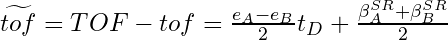
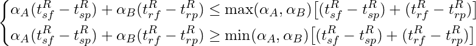
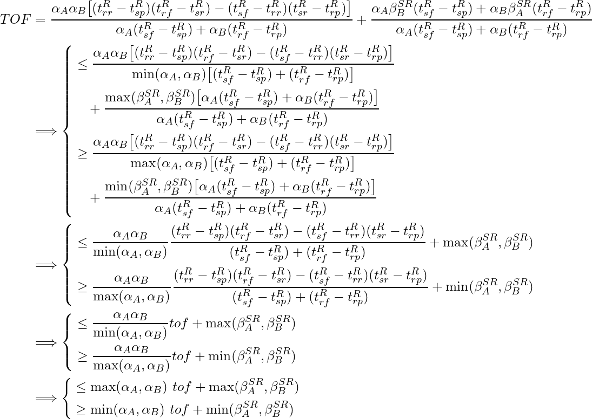

<!-- ## 摘要 -->

在UWB时钟模型的文章中，我们获得了包含振时钟频率偏移、相位偏移、天线延迟等的UWB时钟模型，以该模型为基础，本文对常见的三种双向测距方式的测距误差和UWB时钟模型参数的关系进行具体分析。

<!--more-->

## Error Analysis For UWB TWR Ranging

在[`UWB系统时钟模型`]()中我们推导出了UWB模块的包含晶振误差和天线延迟误差的总体时钟模型：

  

其中，$\alpha_f^M$为模块M相对全局参考时钟的归一化频率，理想值为1，因而归一化频率偏移误差$e_f^M$为：

$$
e_f^M = \alpha_f^M - 1.0
$$

基于该UWB时钟模型，本文将继续分析UWB时钟模型参数和TWR测距误差的关系。

## TWR测距简介

TWR(Two Way Ranging)，双向测距，指在测距过程中存在测距消息的发送和接收两种情形，常见的模式是某一方发送测距请求消息并接受另一方返回的测距响应消息。根据测距消息交换协议的不同，TWR测距具有两种典型方式，单边双向测距SS-TWR和双边双向测距DS-TWR，其中单边指测距过程由一方发起请求，另一方响应，最后只有发起方能获得测距结果，而双边指测距过程中双方都会发起请求并进行响应，使得测距过程结束时双方都可以计算出测距结果。

以下讨论中，$t_{msg}^{S/R}$代表发送或接受消息msg时的系统全局参考时间或物理世界时间，$T_{msg}^{S/R}$代表发送或接受消息msg时UWB模块所记录的时间戳，根据前述UWB时钟模型，有

  

1. **SS-TWR**：单边双向测距

    

      
    

    SS-TWR中，A为测距请求消息发起方，而B为测距响应消息应答方，测距消息交换流程为：

    1. A在$t_{req}^S$(模块时间为$T_{req}^S$)时向B发起测距请求消息
    2. B在$t_{req}^R$(模块时间为$T_{req}^R$)时收到来自A的测距请求消息
    3. B在$t_{res}^S$(模块时间为$T_{res}^S$)时向A回复测距响应消息
    4. A在$t_{res}^R$(模块时间为$T_{res}^R$)时收到来自B的测距响应消息

    最后**A**根据这4个时间戳即可计算出A，B之间的飞行时间，完成测距过程。

    

      
    

2. **DS-TWR**：双边双向测距

    

      
    

    原始的DS-TWR测距过程中测距双方A，B需要交换4条测距消息，即A发送测距请求消息，B返回相应的测距响应消息，然后B发送测距请求消息，A返回相应的测距相应消息。在整个测距过程中，A，B都是测距请求的发起方，也同时时测距响应的应答方。在这种测距模式下，测距双方是一种地位对等的关系，从而可减小由于A，B的时钟频率偏差导致的测距误差。

    仔细分析原始的DS-TWR测距过程可以发现，第2条和第3条消息都是由同一方连续发送的，因而可以合并为同一条消息，从而改进DS-TWR为3消息模式，测距消息交换流程为：

    1. A在$t_{sp}$(模块时间为$T_{sp}$)时向B发起测距查询消息
    2. B在$t_{rp}$(模块时间为$T_{rp}$)时收到来自A的测距查询消息
    3. B在$t_{sr}$(模块时间为$T_{sr}$)时向A回复测距响应消息
    4. A在$t_{rr}$(模块时间为$T_{rr}$)时收到来自B的测距响应消息
    5. A在$t_{sf}$(模块时间为$T_{sf}$)时向B回复测距结束消息
    6. B在$t_{rf}$(模块时间为$T_{rf}$)时收到来自A的测距结束消息

    最后**B**根据这6个时间戳即可计算出A，B之间的飞行时间，完成测距过程。A，B间飞行时间的计算有2中常用方法：

    - SDS-TWR：为充分利用测距双方的对称性来抑制双方时钟频率偏差对测距结果的影响，这种方法要求A，B双方返回测距响应消息的延迟尽可能相等，即$T_B^R \simeq T_A^R$，距离计算如下：

        

          
        

    - AltDS-TWR：该方法无需$T_B^R \simeq T_A^R$，但计算量相对SDS-TWR较大，距离计算如下：

        

          
        

## TWR测距误差分析

在Decawave的论文[An Alternative Double-Sided Two-Way Ranging Method](https://ieeexplore.ieee.org/document/7822844/)中，作者分析了时钟频率偏移对SDS-TWR测距误差的影响，并提出了一种新的DS-TWR求解方法，即AltDS-TWR，同时分析了时钟频率偏移对该方法测距误差的影响。然而Decawave论文的分析过程并未考虑收发天线延迟对测距结果的影响，在这里我们利用本文开始处所提到的UWB时钟模型来分析几种常见的TWR测距方式的误差与时钟模型参数的关系。

1. **SS-TWR**：单边双向测距

    

      
    

    通常情况下，有，$t_A^S \gg tof$，$t_B^R \gg tof$，$t_A^S \simeq t_B^R$，另$t_D \triangleq (t_A^S \simeq t_B^R)$，从而

    

      
    

    SS-TWR测距误差：

    

      
    

    即，SS-TWR测距误差正比于测距双方的频率偏差大小以及测距消息的响应时长，同时也有由测距双方天线的发射接收时延差所引起的测距偏置误差。

2. **DS-TWR**：双边双向测距

- SDS-TWR：

    

      
    

    记$\Delta t_{AB} = t_B^R - t_A^R$，有，

    

      
    

    即，SDS-TWR测距误差正比于测距双方频率偏差之和的均值与测距双方距离的乘积，也正比于测距双方频率偏差大小与测距双方的消息响应时长差的乘积，此外还有由测距双方天线的发射接收时延差所引起的测距偏置误差。

- AltDS-TWR：

    

      
    

    此外，根据

    

      
    

    

      
    

    带入$TOF$中，有

    

      
    

    从而，测距误差为：

    

      
    

    即，AltDS-TWR测距误差受到测距双方频率偏差大小，测距双方距离，以及测距双方天线的发射接收时延差的影响。
