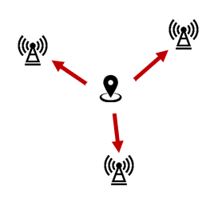
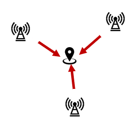
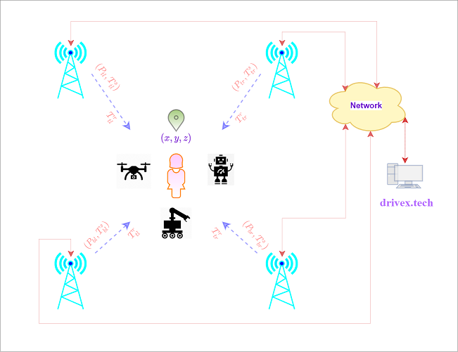

<!-- ## 摘要 -->

本文简要介绍UWB无线定位技术应用于自主移动机器人领域和人机协作领域的技术挑战和方案优势，通过对比现有主流移动机器人定位导航方案和现有主流UWB定位方案的优缺点，得出将UWB技术应用到自主移动机器人、大规模人员导航、以及人员机器人混合定位任务协作等领域所必须的UWB方案技术指标。

<!--more-->

## 背景简介

### 智能移动机器人定位导航

工业化进程不断加快，智能化的机器人取代人工进行简单和重复性的劳动也成为降低成本，增加效率，保证产品质量等重要途径，自主可移动机器人(AMR)作为众多机器人类别中的一类，赋予机器人自主移动的能力，极大地扩展了机器人的应用场合，如：

1. 搬运物流机器人：用于智能仓储，智能工厂等，例如，用于亚马逊仓库的Kiva机器人，淘宝菜鸟仓库机器人等
2. 扫地机器人：国外的如iRobot，Dayson等，国内的如科沃斯扫地机，小米扫地机等
3. 引导机器人：用于园区，餐厅，展厅，会展厅，博物馆等行人导引服务
4. 智能汽车：通过车身装载的多种传感器（如激光雷达，摄像头，GPS，UWB等）实现自主行驶，自动泊车，反向寻车，主动召唤等功能

为使机器人具有自主移动的能力，其至少必须具备感知自身位置和规划行进路线的能力，这类似于我们通过GPS进行定位并通过Google地图等决定行驶路线。对于移动机器人来说，定位、路径
规划、避障这3个功能模块相辅相成，共同促进机器人的自主性和智能性，而较好的定位能力是其他两个模块能高效运行的前提和基础。

### 人机空间感知与任务协作

另一方面，为更好地为访客提供服务或优化工业生产流程等，服务器及人或部分工业机器人对柔性化提出了更多要求，需要人和机器人具有相互感知和交互的能力，从而最终能够实现快速高效的任务协作。移动型服务机器人能够实时感知客户的位置为客户提供导引、行李搬运等服务，工厂搬运机器人实时感知员工位置信息能够实现精细化的订单配给追踪和货物分拣等能力。

### 移动机器人主流定位技术

目前主流商业方案中对移动机器人的定位导航主要有3个类别：

1. 激光雷达(Lidar)定位导航方案

    采用激光雷达作为主要的数据感知源，通过其对周边环境实时测量所得的2D/3D环境点云数据，利用临近点云配准算法，全局点云注册算法等实现对机器人自身的位置计算和对运行环境的地图构建。激光雷达测距精度极高(~5mm)，在强光直射以外的环境中运行稳定，同时点云本身也包含附近空间占用信息，可直接进一步用于机器人的路径规划和导航避障等。激光雷达方案依据对周围环境的检测、感知、建模方式不同，又主要分为2类：

    - 自然环境激光导航方案

        激光雷达直接对周围环境测量以获得点云信息，对相邻时刻的点云信息利用点云匹配算法来估计相对位移，并利用当前位置把该位置相对应的点云在全局环境点云中进行注册。

    - 反光柱激光导航方案

        在大型空旷的厂房或狭长简单的走廊等场合，由于缺乏足够的关于周边环境的几何特征信息，自然导航的激光雷达方案精度降低很多甚或可能失效，为解决这个问题，会人为的在运行环境中随机地布置一些涂有高反射性材料的反光板或反光柱，激光雷达在运行过程中不断地检测和追踪这些标识物体，并同时利用这些标识物体增量式地构建关于环境的稀疏特征地图。

2. 视觉(Visual)定位导航方案

    采用摄像头作为主要的定位数据来源，通过获取关于周围环境的实时图像数据，利用计算机视觉技术，如特征点检测与匹配，光流追踪等，增量式地构建关于环境的视觉特征地图，并利用构建的稀疏地图信息进行实时定位，回环检测以消除累积误差，以及位置重定位等。视觉方案对比激光雷达方案成本较低，对环境的语义信息感知较为丰富，然而视觉方案对环境的光照信息和视觉纹理特征等要求很高，在弱光、强光、弱纹理等场景下无法工作，视觉传感器对安装位置或携带方式也有很大要求，不容易扩展到对人员的定位导航，此外，视觉方案所生成的稀疏环境地图也无法直接用于机器人的路径规划和导航避障等。激光雷达方案依据对周围环境的检测、感知、建模方式不同，又主要分为2类：

    - 自然环境视觉导航方案

        摄像头直接对周围环境成像以获得图像数据，并进而从中提取具有丰富自然环境特征的特征点，利用这些特征点重建环境的稀疏特征地图并通过追踪这些特征点来实现对机器人自身的的定位。

    - 二维码标签视觉导航方案

        在一些无纹理或弱纹理的场合，或视觉传感器受限于安装位置无法有效记录周围环境的情形(如仓库搬运AMR由于需要运载大型物品等，摄像头只能位于机器人底部，成像质量和图像纹理特征都较差)，自然导航的视觉方案精度通常很差甚或无法工作，为解决这个问题，会人为的在运行环境中布置很多容易检测和识别的二维码标签，机器人通过在运行过程中不断地检测和追踪这些二维码标志，即可实现对自身的定位并同时增量式地构建环境的稀疏二维码标志地图。

3. GPS定位导航方案

    作为室外场景最主要的定位方案，GPS接收机通过同时接收多个已知位置信息且时钟同步的卫星所发射的信号来计算位置坐标，GPS可支持对无限数量的设备同时进行精度为~10m的定位，利用多个接收机实现DGPS或RTK可进一步提升定位精度到1-10cm的范围。然而，由于无线信号本身的特性和环境所引入的噪声、干扰，GPS导航系统不适应用在室内或者水下机器人的导航中以及对于位置精度要求较高的场景。

### UWB无线定位系统

当前的UWB定位系统依据定位原理的不同主要分为2大类：

- TOF测距定位模式：标签设备通过TWR(双向测距)按照一定次序和临近基站分别进行测距，然后根据多边(multilateral)定位算法即可计算出自身的位置坐标；

- TDOA距离差定位模式：利用标签到其周围两个基站的距离差，求解TDOA方程即可获得标签自身的位置坐标；

TOF方案相较TDOA方案在用户容量密度、定位输出频率、系统扩展性等方面具有很大劣势，不太适合大规模场景下同时对大量的人员或移动机器人进行定位和导航，因而本文主要介绍TDOA方案原理和其技术特点。

#### TDOA定位原理

TDOA(到达时间差)是用于UWB无线定位的一种主要技术方式，相较于TOF(飞行时间测距)方式，由于基站和标签端交互信息的次数减少，一方面可降低系统的功耗，另一方面也可增大定位系统的用户并发数和容量密度。基于TWR(双向测距)模式的TOF方案由于需要每个标签和测距范围内的所有基站都进行消息交换，极大地限制了用户容量密度和对高频率进行定位能力，本文主要关注中大规模场景下对大量移动机器人或人员进行导航的需求，而使用TWR测距的方案很难满足，故不再讨论基于TWR测距方案。

TDOA需要系统内的所有基站时间严格同步，依据同步方式的不同分为有线同步和无线同步两种，有线时间同步方案通过专用的有线时间同步器进行时钟分发，精度\~0.1ns，但时钟网络的部署和维护代价以及成本较高，无线时间同步方案不需要特殊的同步设备，精度\~0.3ns低于有线时间同步，不过其系统部署维护难度和成本都相对较低。由于无线时间同步方案从部署维护难度，系统扩展灵活性，和成本上都优于有线时间同步方案，因而本项目采用无线同步技术。

在对用户进行定位和导航时，UWB定位系统根据标签和基站收发关系的不同有两种实现方式：

1. 服务器端模式TDOA (也称为：上行TDOA，主动式TDOA等)

    

    

    
    服务器端模式TDOA
    
     
    
    

    

    在这种方案中，标签端周期性的广播定位信标(beacon)信号，基站记录标签beacon信号的接收时间戳并将该标签相关的信息发往中心定位引擎服务器，由于所有基站的时间都已同步，定位服务器即可根据beacon信号到达不同位置基站的时间差值来计算标签的位置信息。简单的说，标签端***发送***定位信标信号，在***服务器处***完成标签的位置计算，根据具体场景需求服务器可以将标签的位置信息通过网络(WIFI/Bluetooth/Zigbee/UWB/...)再发送回标签端。对大多数长度的消息来说，其发射时长<200us，故理论上在该区域最多可实现约5000次定位每秒，假若定位频率为1Hz，根据ALOHA理论，为达到尽可能小的信道冲突，只能支持约18%的标签同时工作，也就是有约5000*18% = 900个标签可以正常工作。

    该方案相较于基于客户端TDOA方案更适合**人员监控和资产追踪等场景**：
        - 医院、养老院、护理院、隧道、矿井等需要进行人员监控和追踪的场所；
        - 工厂、企业等需要对资产、员工、访客、设备等进行追踪的场合；
        - 大型公共场所如商场、会展厅、博物馆等需要对人流密度进行监控和分析的情形；
        - ...

2. 客户端模式TDOA (也称为：下行TDOA，被动式TDOA等)

    

    

    
    客户端模式TDOA
    
     
    
    

    

    在这种方案中，基站端按照一定的次序在相应的时间槽上广播定位信标(beacon)信号，标签记录基站beacon信号的接收时间戳并从中提取出基站beacon信号的发送时间戳，由于所有基站的时间都已同步，标签本身即可利用不同基站的位置信息和不同基站beacon信号到达的时间差计算出标签自身的位置信息。简单的说，标签仅***接受***基站发送的定位信标信号，在***本地处***完成标签的位置计算，根据具体场景需求标签可以将自己位置信息从通信信道(UWB/5G/WIFI/Bluetooth/Zigbee/...)再发送到服务器端。由于标签不需要发射，只需要接收，标签容量密度可以做到无限，持续地监听和接收信号会导致标签功耗相对较大，不过标签端可通过利用网络的时间槽信息来实现在特定的时刻和按预设的频率来启动接收，从而优化功耗。

    该方案相较于基于服务器TDOA方案更适合对大量人员或机器人定位导航类场景：
       - 工厂、仓库、园区等地的AMR(自主移动机器人)主动导航；
       - 大型公共场所如商场、会展厅、博物馆、医院、停车场等地的人员导航和自动导引机器人；
       - 大规模机器群体（如无人机队，仓储物流搬运机器群等）编队、任务协作、智能调度优化等；
       - 中大规模场景下多人在线互动的VR应用与游戏等；

服务器端模式TDOA和客户端模式TDOA比较：

| | 客户端模式TDOA | 服务器端模式TDOA |
| :-: | :-: | :-: |
| **定位精确度   定位稳定性** | ~10cm | ~10cm |
| **输出频率** | 10-100Hz   和网络时间槽协议参数有关,也和基站数量有关 | ~ 1000/并发用户数   并发用户数越多,定位频率越低 |
| **实时性   标签自身定位延迟** | <5ms | 50-500ms   (WIFI回传) |
| **用户容量密度** | 无限制 | ~ 1000/定位频率   定位频率越低，并发用户量越大 |
| **多传感器数据融合能力** | 好   标签自身计算位置 可方便融合其他传感器(编码器,IMU等)数据 | 差   位置计算在服务器端完成 所有传感器数据需发送到服务器进行融合 |
| **设备功耗** | 标签功耗较高   基站功耗较低 | 标签功耗较低   基站功耗较高 |
| **用户隐私** | 好   标签端无需发送信号，定位网络无法对网络内的标签设备进行监测 | 低   标签端需要发送信号，网络可追踪定位网络内的所有标签设备 |

## UWB无线定位系统与移动机器人定位导航

在室外场景下，GPS无线定位系统已经成为传统车载导航，以及各种自动驾驶技术的标准配置传感器。尽管对于室内应用场景，也存在多种无线定位技术(如WIFI、蓝牙、UWB等)，然而所有这些室内无线定位技术很少见到用于智能机器人作为标配的定位传感器。目前用于室内场景的自主移动机器人(AMR)，实现其对自身定位能力的主要传感器是激光雷达(Lidar)或摄像头，并利用机身携带的其他传感器(如轮式编码器、IMU等)进行辅助定位从而增加定位精度和定位稳定性。

要作为移动机器人的主要定位传感器，定位系统需要满足至少以下几个性能指标：

1. 较高的定位精度

    室内场景由于空间有限，且存在人员、物品等分布在整个环境中，为使机器人能够自主行驶，有效地规划行进路线，避开障碍物和行人等，其需要能够精确的估计自身在定位地图中的位置，较大的定位误差会使得机器人规划出较差的行进路线甚或是无法规划出行进路线，而较大的定位不稳定性会使得机器人执行器出现很大控制量变化，影响机器人行驶的稳定性。通常来说，在轮式编码器和IMU数据的辅助下，主定位传感器应提供<10cm的定位精度和定位稳定性。

2. 较低的定位延迟

    机器人需要不停地获取自己的位置信息从而进行路径规划、导航、避障等，较大的或不稳定的定位输出延迟会导致机器人在行驶过程中晃动摇摆，甚至撞到障碍物等。对于大多数慢速搬运机器人来说，定位延迟需<10ms。

3. 较高的定位输出频率

    由于机器人在当前时刻的位置坐标只能从最近一次定位位置差值外推而来，因而在输出频率很低时，当前时刻的位置估计会有很大的误差，这会使得机器人很难避开地图中的固定障碍物。尽管相邻定位时刻的位置信息可由轮式编码器和IMU等来估计和补偿，但轮式数据可能打滑，以及IMU对于较长时间的位置积分具有很大误差，因而主定位传感器通常需要能提供系统内的所有用户设备>5Hz的定位输出频率。

4. 易融合多种传感器数据

    仅用单一的传感器很难保证移动机器人在复杂的室内条件下长期稳定地工作，GPS、UWB等无线定位传感器很容易受到遮挡、多径、非视距传播等影响从而导致定位失败，而摄像头方案容易受到环境光照、动态障碍物遮挡等影响从而无法工作，激光雷达在强光、简单的环境几何结构场景下也不能很好的工作，轮式里程计和IMU数据不太依赖外部的工作环境，然而作为一种使用航迹积分推算的定位传感器，具有很大的累积误差，单独使用无法提供长期精确的定位结果。通常移动机器人通过自身携带的多种类型传感器来进行数据融合从而提供机器人定位导航的能力，因而某传感器方案如果要作为机器人主要的定位数据源，其应该可以支持快速简单的融合其它辅助类型传感器的数据。

5. 安装部署容易，对环境改动小

    在工厂、港口等场景中，AMR(自主移动机器人)正不断地取代AGV(自主导航机器人)，主要原因便是AGV作为一种传统的方案，需要在其所工作地环境中铺设地面导航磁条，或埋设地底导引线等，主要问题是系统建设成本高，且当环境改变、机器人路径改变、或系统升级时需要很大的代价重新调整和适配。针对自主移动机器人，当前地主要发展方向是尽可能多地靠近自然环境导航方式，尽可能少地更改现有工作场地，以及支持快速地安装、部署、系统升级等。

当前业界主流的无线定位方案很难同时满足以上几点需求：

1. WIFI、蓝牙方案在使用RSSI定位算法时可满足较低的定位延迟，易结合多种传感器数据，以及可利用现有WIFI基站从而安装部署成本较低，然而最大的问题在于其所能提供的定位精度较差(~5-15m)，无法满足移动机器人定位最重要和最基本的要求；

2. RFID定位工作于TOF测距或TDOA模式下时可提供较好的定位精度，但其最大的问题是工作范围较小(<5m)，从而导致需要安装大量定位基站，部署成本较高，导致后期维护和升级代价很大；

3. UWB定位作为目前精度最高(~10cm)的定位方案，从定位精度上来说可基本满足移动机器人的定位需求，然而当前主流的UWB商业化技术方案(TOF模式或服务器端(上行)TDOA模式)却不太适合对工厂、园区等场景下的大量移动机器人定位导航，也不支持这些场景下的大量的人员实时导航和大规模的人机协作任务。具体来说：

    - TOF测距定位模式：该方案需要场景中的每个标签设备都和其周围的基站进行测距，因而很大地限制了系统的用户容量密度，不能提供实时高频地对大量人员和机器人进行混合定位的能力。此外，该方案要求精确的手动测量每个基站的位置坐标，增加了系统的安装和升级成本。

    - 服务器端(上行)TDOA定位模式：a). 该方案在Aloha工作模式下，可实现对所有标签设备总共~1000次每秒的定位能力，然而该方案随着区域内用户数量的增多，其单用户的定位频率反比下降，在有大量移动机器人和人员同时工作时，很难提供稳定地高频率位置输出。b). 此外，该模式下，标签设备并不能直接计算出自身的位置，位置在服务器完成计算并回传到标签处，因而这会引入很大的定位延迟(WIFI下30-500ms)，而且实现多传感器数据深度融合也需要标签设备将其他传感器数据传送到服务器，对视觉图像、激光点云等需要较大宽带传输信道的数据这会引入很大的复杂度和成本。c). 和TOF方案一样，该方案要求精确的手动测量每个基站的位置坐标，使得系统的安装部署和升级成本较高。

### 项目解决方案

从上述分析可以看出，主要无线定位方案中能满足移动机器人最重要和最基本的精度指标的只有UWB定位方案，然而当前商业化的主要技术方案(TOF模式和服务器端TDOA模式)在定位延迟、系统用户容量密度、安装部署成本等方面存在很大的不足，限制了基于UWB的无线定位系统在移动机器人领域的大量应用。

另一方面，相较于激光雷达、摄像头等方案，应用UWB无线定位系统具有以下优点：

- 设备功耗较小，计算力需求低；
- 工作环境内可实现全局绝对定位，不会出现激光、视觉方案中在大尺度环境运行中的累积误差；
- 不受光照、和小尺寸障碍物遮挡等影响，定位系统覆盖范围内都可提供精确的定位结果；
- 便于安装和携带，除了移动机器人外，可同时实现对人员的定位和导航，人员机器人共用同一套坐标系统，从而方便进一步支持人机交互任务和协作任务；

项目原理

 

本项目解决将UWB无线定位技术应用于大量自主移动机器人场景，以及大规模人员与机器人混合定位导航的场景，项目通过原创性的网络协议、时间同步算法、自动组网与位置计算标定算法等，解决了现有主流商业UWB定位方案具有的定位延迟大，高并发用户时定位输出频率低，不易结合多传感器数据，以及安装部署耗时较长，成本较高的问题。项目主要的技术特点包括：

- **客户端模式(被动式)TDOA**：支持无限容量的移动机器人和人员同时进行定位和导航，可高频率(10-100Hz)和低延迟(<5ms)地输出标签的位置坐标；

- **抗多径干扰能力的无线时钟同步网络**：通过原创性的协议算法，系统可自动识别出大部分多径传播到达的接收消息，并自动移除这些干扰消息从而很大地提升网络的无线时钟同步精度；

- **快速安装部署，自动基站位置计算与标定**：通过原创性的组网协议和后端网络算法，系统可实现自动计算校准各个基站的位置坐标，无需人工手动对基站位置进行测量，使得可以快速地安装部署该UWB定位系统；

- **快速组网，所有基站处于同一定位网络，无需划分定位子小区**：通过原创性的组网协议，系统实现了让所有基站处于同一定位网络，无需通过很多的定位子网络来实现覆盖整个工作场景。这会带来两个方面的好处：

    1). 无需提前划分子网络可极大地简化系统的设计和部署，后期添加或删除基站时无需考虑在子网络的分布或对现有子网络的影响，从而增加了系统的扩展性和伸缩性；

    2). 不进行子网络的划分可保证处在多个子网络交界的标签现在可利用所有来自不同子小区的基站的信息进行定位，提升定位精度和鲁棒性，同时也可避免处在子网络边缘的标签在切换定位子网络时带来的位置抖动，导致定位结果的不连续和不一致；

该系统针对的可能应用场景主要包括：

1. 仓储、物流机器人定位导航与人机任务协作

    工厂、仓库、园区等场景中，越来越多的自动搬运机器人、自动叉车等开始进入并逐渐取代低效昂贵的人工操作，使用UWB定位系统作为移动机器人定位导航的主要方式，有助于快速构建大规模、可伸缩、易扩展、高可靠的机器人群体系统，以及实现人员和智能机器人间的相互感知交互和高效任务协作。

2. 智能停车场与无人驾驶汽车

    用户停车难、寻车难的问题在当前的大型停车场中日益凸显，另一方面，携带更多高级传感器的智能汽车也逐渐增加。智慧化的下一代停车场建设首先需要解决用户用户停车寻车的问题，而更进一步，智慧停车场也需要进行业务升级以便利用用户停车的这段闲置时间提供车辆维护相关的附加服务，如充电、检修、洗车、保养等。

    连接用户、智能汽车、以及智慧停车场的前提条件就是相互的位置感知：

    - 智能汽车获取其在停车场的定位信息可实现**自动泊车**；
    - 用户获取自己在停车场的位置可实现对智能汽车的**反向寻车**；
    - 更进一步，智能汽车通过获取自己的位置以及用户在停车场某出口的位置可实现对汽车的**主动召唤**；
    - 在停车过程中，智能汽车还可利用停车场的地图信息自动行驶到汽车服务点进行汽车充电或维护服务；

