<!-- ## 摘要 -->

本实验主要测试客户端模式(被动式、下行模式)方案的UWB定位系统其定位性能，包括TDOA到达时间差稳定性、定位精度等。

<!--more-->

<!-- # 客户端模式(被动式)TDOA定位精度测试 -->

## 定位性能测试指标

客户端模式TDOA

 
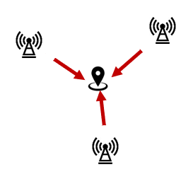

在使用客户端模式(被动式、下行模式)的UWB定位系统中，基站端按照一定的次序在相应的时间槽上广播定位信标(beacon)信号，标签记录基站beacon信号的接收时间戳并从中提取出基站beacon信号的发送时间戳，由于所有基站的时间都已同步，标签本身即可利用不同基站的位置信息和不同基站beacon信号到达的时间差计算出标签自身的位置信息。

在服务器端模式(主动式、上行模式)TDOA系统中，标签广播的beacon消息可同时被多个基站接收，而系统中的基站是互相时间同步的，因而在该模式下可直接计算出标签到任意两个接收到该beacon信号的基站的到达时间差。而在客户端模式(被动式、下行模式)TDOA系统中，由于在无线信道上同时发送同频的无线定位信号会导致互相干扰，因而系统中的基站需要按照一定的规则来分配信道时间资源，基于调度的分时方案在时间域上将物理信道的划分成多个时间槽，每个时间槽形成一个逻辑子信道，不同的基站在其所分配的时间槽内可发送定位消息，而其它所有基站则在该时隙内监听信道并接收定位消息。

由于在客户端模式TDOA系统中，基站需要在不同的时间槽内发送定位消息，而标签接收到的两个基站beacon信号的时间戳的差值也并非标签到这两个基站的到达时间差，这使得在该模式下TDOA的计算更为复杂，同时对基站的时钟同步精度也具有更高要求。

本实验测试标签处于静止状态下的定位性能，主要包括以下两个指标：

1. TDOA到达时间差稳定性
    TDOA算法利用标签于不同基站信号的到达时间差来计算标签的位置坐标，在静止状态下，标签到各个基站的距离保持不变，从而标签对任意两个基站的达到时间差理论上也保持不变，这表明可以测试标签对任意两个基站的到达时间差的稳定性来大致评估出定位结果精度；
2. 定位精度
    计算出标签的位置坐标，其位置分布直接体现出系统在该位置处的定位精度；

### TDOA到达时间差计算方法

假定系统中已时间同步的基站A1，A2在其相应的时间槽TS1，TS2发送定位信号，在第$k$个epoch中其所发送信号的系统全局时间戳分别为$T_k^{A_1}$，$T_k^{A_2}$，而标签在第$k$个epoch中接收到的基站A1，A2信号的本地时间戳分别为$t_k^{A_1}$，$t_k^{A_2}$，则标签相对基站A1，A2的归一化频率分别为：

$$
\left\{
\begin{aligned}
\alpha_k^{A_1} = \frac{t_k^{A_1} - t_{k-1}^{A_1}}{T_k^{A_1} - T_{k-1}^{A_1}} \\
\alpha_k^{A_2} = \frac{t_k^{A_2} - t_{k-1}^{A_2}}{T_k^{A_2} - T_{k-1}^{A_2}} \\
\end{aligned}
\right.
$$

标签在时间$k$时相对定位系统全局时钟的归一化频率可简化计算为：

$$
\alpha_k = f(\alpha_k^{A_1}, \alpha_k^{A_2}, \cdots) = \frac{\sum\limits_{n=1}^N \alpha_k^{A_n}}{N}
$$

利用上式给出的$\alpha_k$对第$k$个epoch接收到的两个基站beacon信号的时间戳的差值进行修正，即可获得获得标签对这两个基站的到达时间差结果：

$$
t_d^{A_i,A_j} = \frac{t_k^{A_i} - t_k^{A_j}}{\alpha_k} - (T_k^{A_i} - T_k^{A_j})
$$

为便于直观理解和比较$t_d^{A_i,A_j}$，对其乘以光速从而获得标签对两个基站的到达距离差，

$$
t_d^{A_i,A_j} \gets C * t_d^{A_i,A_j}
$$

## 测试实验结果

测试中基站部署位置分布如下图所示：(由于房间桌椅布局和供电等影响，该测试中并未采用较优的基站布局分布，而是近似梯形的分布)

基站位置分布

 
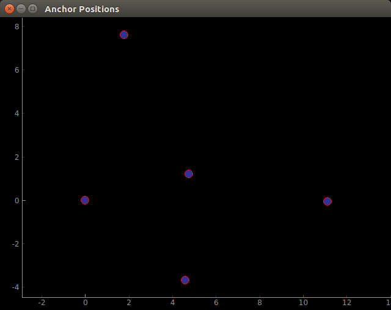

本次实验在定位网络覆盖区域内的4个位置处分别采集了约10分钟的静态数据，第一组数据标签位于定位网络靠近中心位置，其它三组数据标签位于定位网络的边缘处，其中，标签在第二个测试位置处有受到多经干扰和阴影效应的影响，使得接受某些基站信号的时间戳精度变差，以及出现了较大偏差的异常定位结果。

所有4组静态测试的结果分别如下：(在标签位置图中，➕代表计算出的所有标签位置的平均位置，而3个⚪的半径分别代表标签的定位结果的1倍标准差，2倍标准差，和3倍标准差，其值$r$位于图片右上角)

1. 位置1

静态测试位置1

 

用于TDOA计算，标签与临近的2个基站距离的差值随时间变化的曲线如下：

静态测试1-TDOA距离差

 
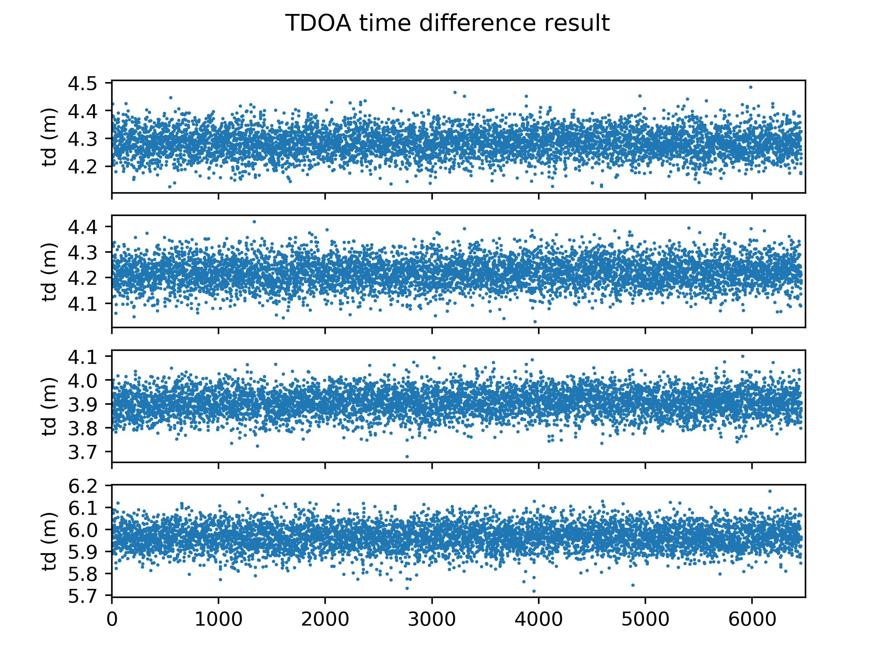

标签计算出的位置位置坐标分布如下，在该位置处定位精度的标准差为0.04m，

静态测试1-定位精度

 
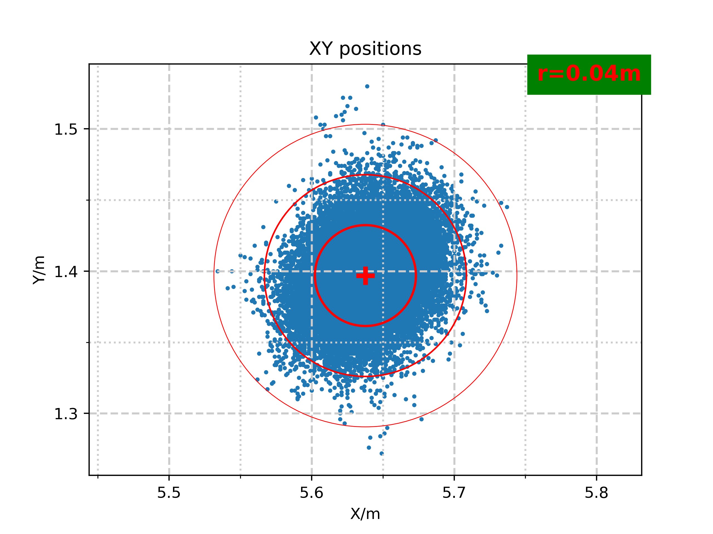

1. 位置2

静态测试位置2

 
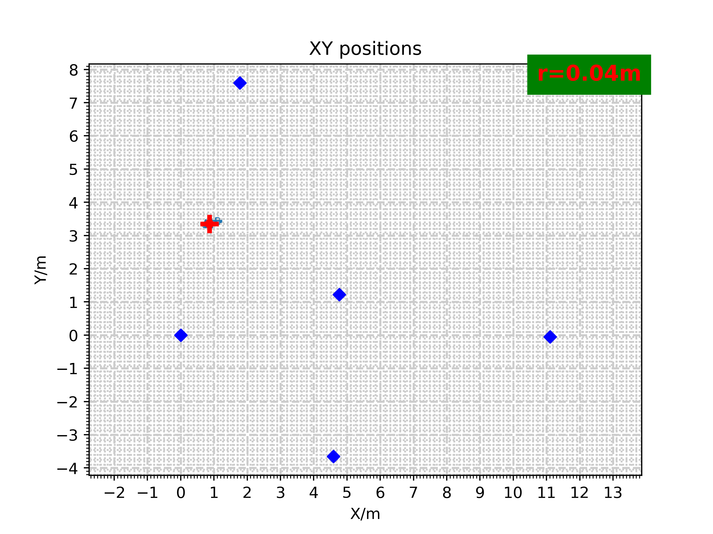

用于TDOA计算，标签与临近的2个基站距离的差值随时间变化的曲线如下，在该测试位置处，标签对某些基站的到达时间差出现较大的异常值，可能是在该位置处标签接收某些基站发送信号受到多径传播或阴影效应的影响，使得UWB芯片不能正确识别出信号的首径。

静态测试2-TDOA距离差

 
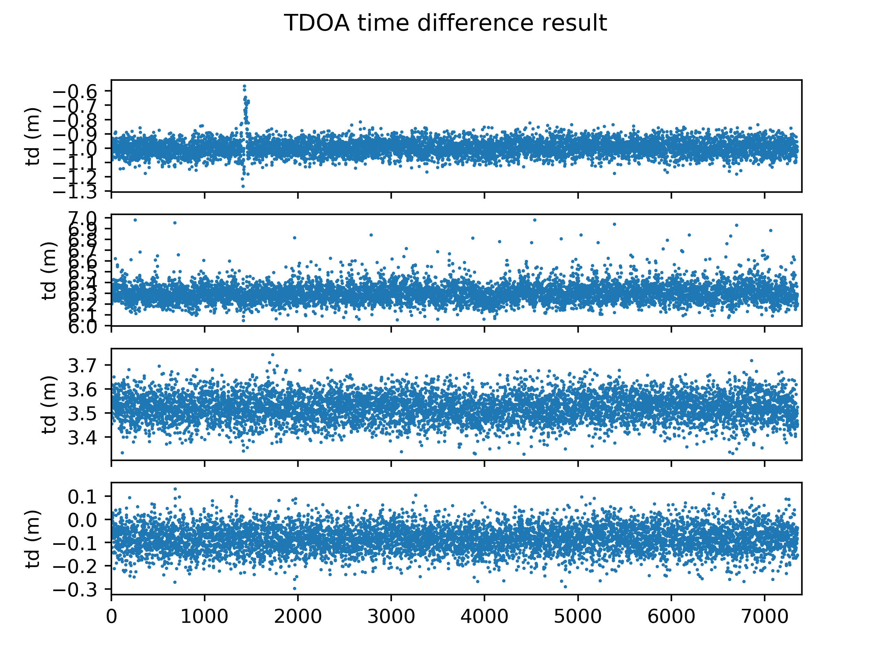

标签计算出的位置位置坐标分布如下，在该位置处定位精度的标准差为0.04m，在该位置处由于TDOA的到达时间差受到环境干扰存在较大异常值，使得定位算法给出了较大误差的异常定位结果。

静态测试2-定位精度

 
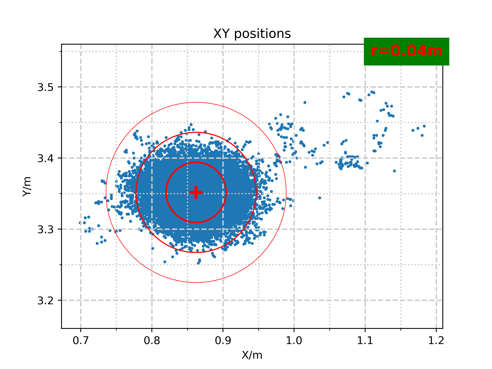

1. 位置3

静态测试位置3

 
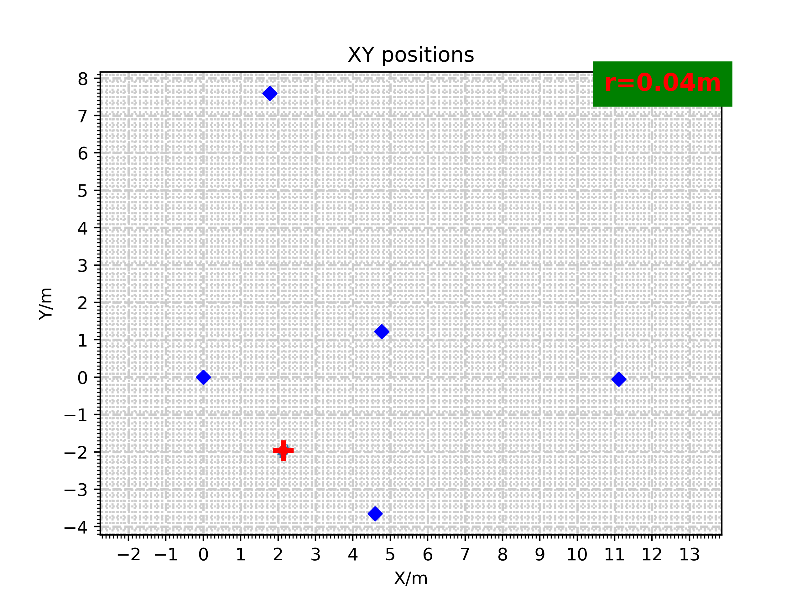

用于TDOA计算，标签与临近的2个基站距离的差值随时间变化的曲线如下：

静态测试3-TDOA距离差

 
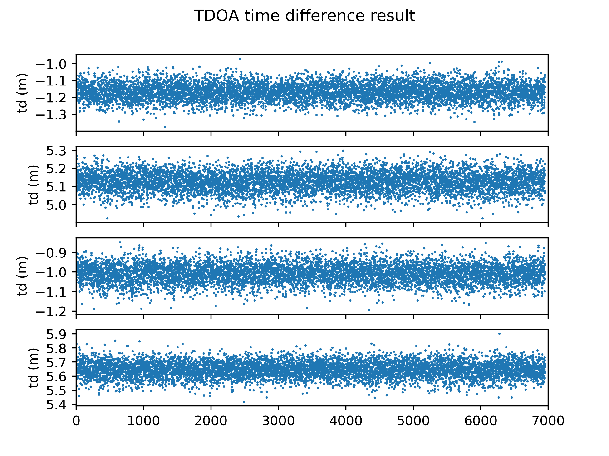

标签计算出的位置位置坐标分布如下，在该位置处定位精度的标准差为0.04m，

静态测试3-定位精度

 
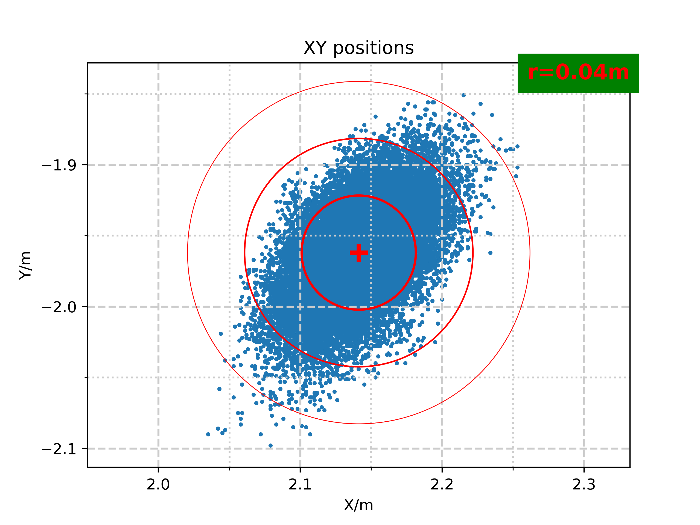

1. 位置4

静态测试位置4

 
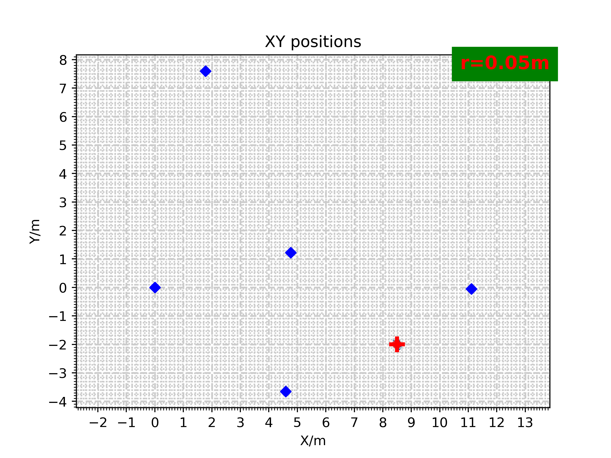

用于TDOA计算，标签与临近的2个基站距离的差值随时间变化的曲线如下：

静态测试4-TDOA距离差

 
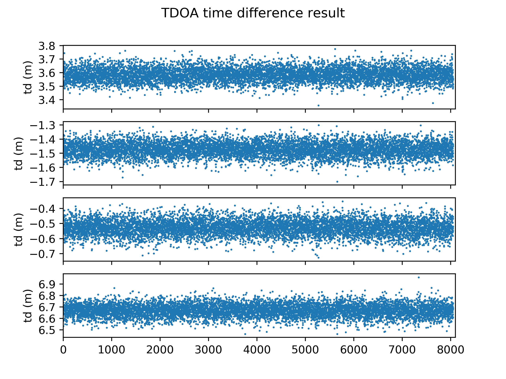

标签计算出的位置位置坐标分布如下，在该位置处定位精度的标准差为0.05m，

静态测试4-定位精度

 
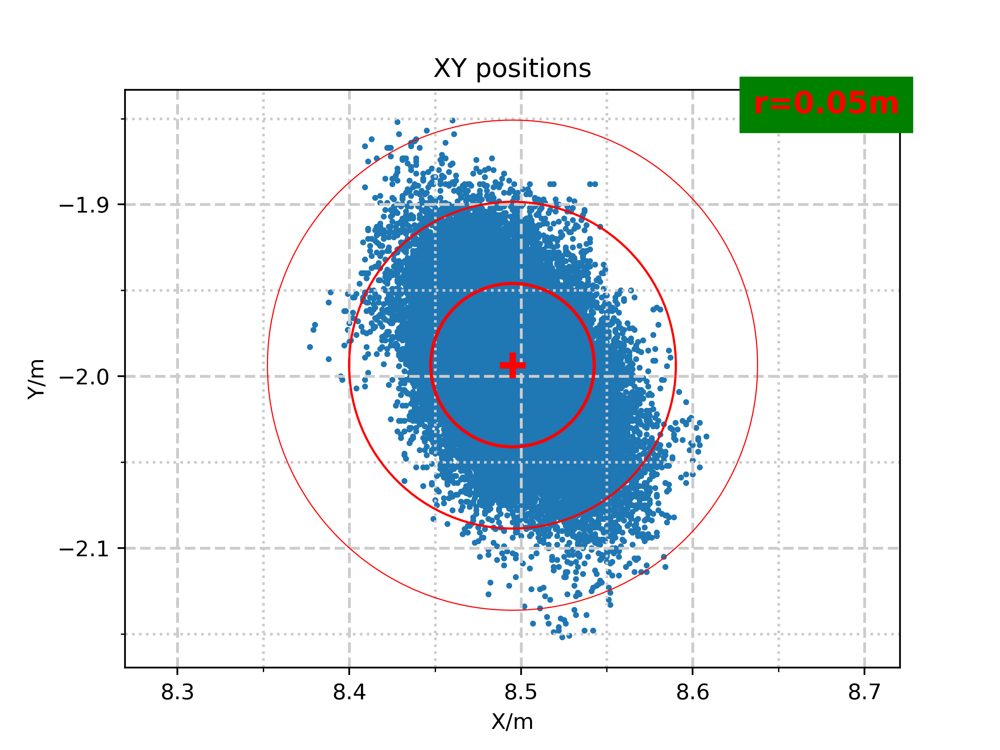

在所有测试位置的实验结果表明，该UWB定位系统在无多径传播或无阴影效应的干扰条件下，系统可稳定提供$\pm 10cm$的到达时间差，系统静态定位精度和标签所处的位置有关，当标签处于定位网络的内部时，可获得在XY方向上最优的0.04m精度标准差，而当标签处于定位网络的边缘时，定位精度略微下降，且定位结果精度在XY平面上呈现明显的各向异性特征。
