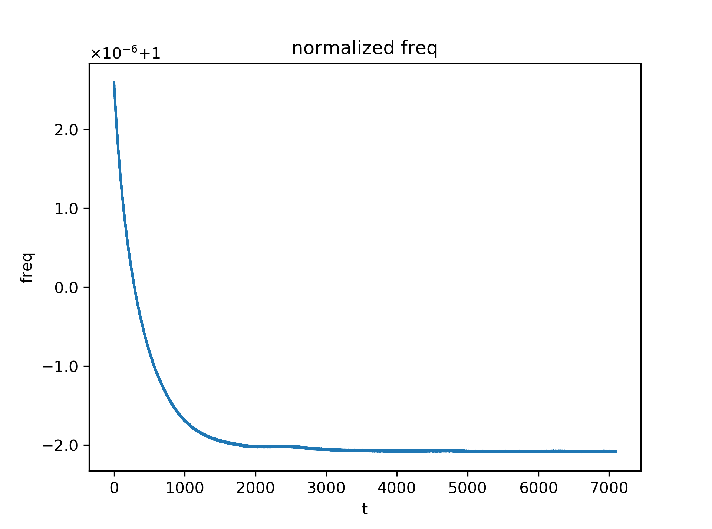
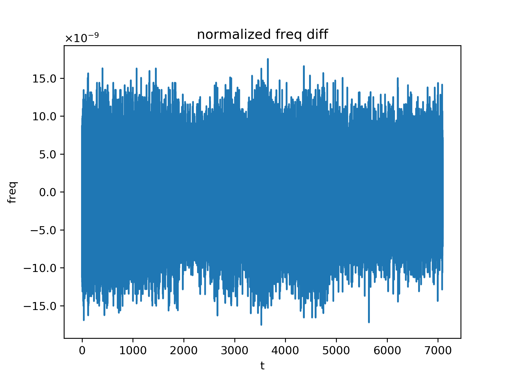
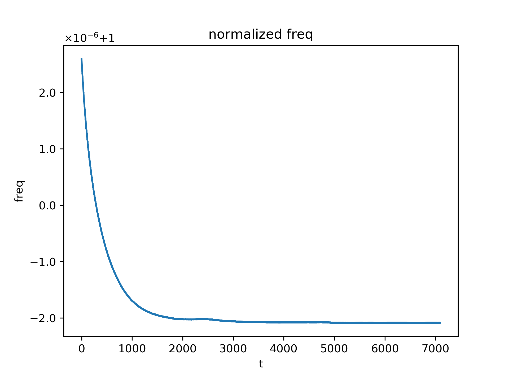
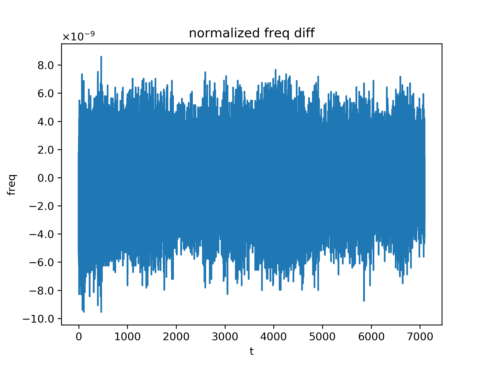
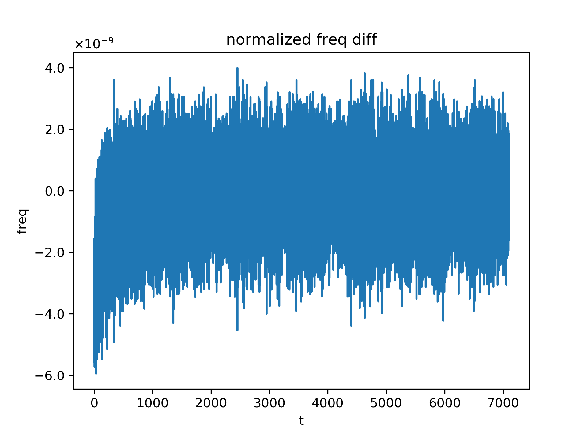
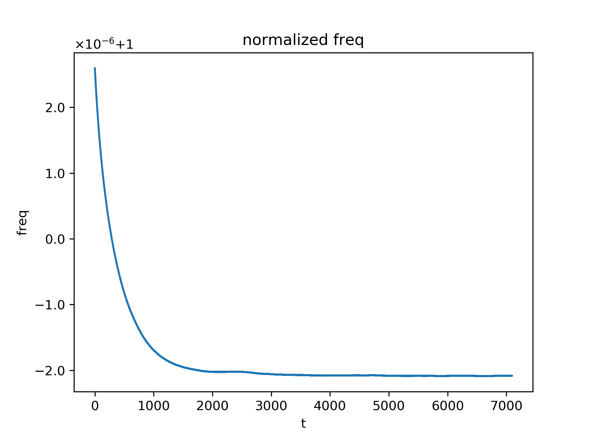
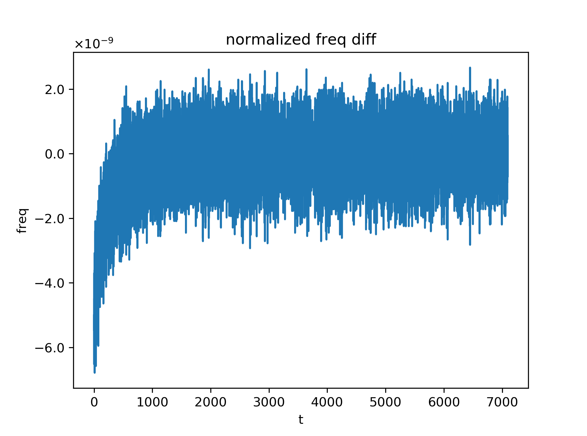
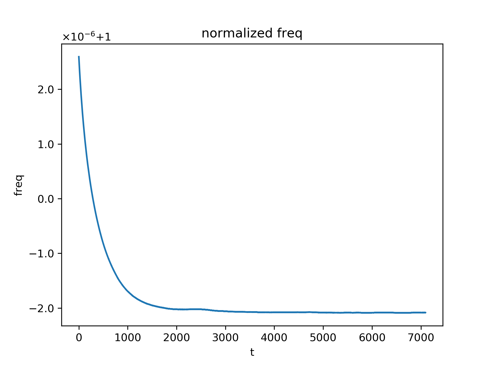
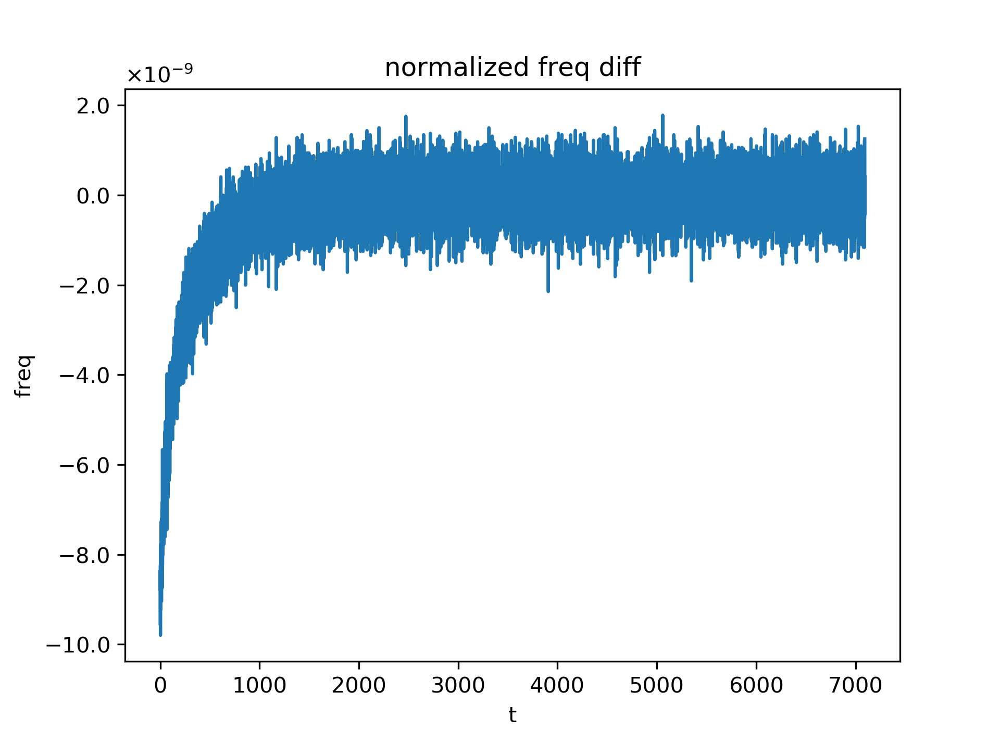

<!-- ## 摘要 -->

基于UWB时钟模型，实验主要关注UWB模块相对系统参考时钟的归一化频率，测试在不同的发送时间间隔下归一化频率偏差随时间的变化关系，以及相邻时刻的归一化频率的差值变化和发送时间间隔的关系。

<!--more-->

<!-- # 晶振时钟频率偏移测试 -->

## 晶振时钟测试原理

基于在[`UWB系统时钟模型`]()中的推导，对UWB模块来说，包含晶振误差和天线延迟误差的总体时钟模型近似为：

$$
t^M = \alpha_f^M t + \beta^M
$$

其中$\alpha_f^M$为该模块相对系统参考时钟的归一化频率，其值的大小约等于1，而$\beta^M$则是该模块相对系统参考时钟的时间偏移量。

假定UWB时钟参考基站按一定的间隔大小连续发送blink数据包，记该时钟参考基站的blink的发送时间为：

$$
t_0, t_1, t_2, \cdots
$$

而UWB模块M则不停接收来自该时钟参考基站的blink数据，记UWB模块M的对每一个blink的接收时间为：

$$
t_0^M, t_1^M, t_2^M, \cdots
$$

根据UWB模块的时钟模型有如下关系：

$$
t_k^M = \alpha_f^M t_k + \beta^M
$$

对UWB模块M两个相邻时刻i,j的数据进行相减，有：***[相邻时刻意味着，$\alpha_f \simeq \alpha_f(t_i) \simeq \alpha_f(t_j), \beta \simeq \beta(t_i) \simeq \beta(t_j)$]***

$$
t_j^M - t_i^M = (\alpha_f^M t_j + \beta^M) - (\alpha_f^M t_i + \beta^M) \simeq \alpha_f^M (t_j - t_i)
$$

即在两个相邻时刻i,j间，UWB模块M的归一化频率可近似为，

$$
\alpha_f^M \simeq \frac{t_j^M - t_i^M}{t_j - t_i}
$$

## 测试实验结果

实验中设置不同的时钟参考基站发送blink数据的时间间隔，分别为50ms，100ms，200ms，300ms，500ms，总计进行5次的数据分析。实验结果主要关注在UWB模块M相对时钟参考基站的归一化时钟频率$\alpha_f^M$随时间的变化特性，包括$\alpha_f^M$随时间变化曲线，以及相邻时刻$\alpha_f^M$的差值随时间变化的曲线。

1. blink时间间隔：50ms

    
    

1. blink时间间隔：100ms

    
    

1. blink时间间隔：200ms

    
    

1. blink时间间隔：300ms

    
    

1. blink时间间隔：500ms

    
    

从实验结果可以看出，在不同的blink数据发送时间间隔下，$\alpha_f^M$随时间的变化趋势是几乎一致的，而相邻时刻$\alpha_f^M$的差值波动则随blink数据发送时间间隔的增大而减小，这可归结为对$\alpha_f^M$的近似中，端点误差的影响被较大的间隔时间所平滑掉了，具体地说，由

$$
\alpha_f^M \simeq \frac{t_j^M - t_i^M}{t_j - t_i}
$$

假定在端点时刻$t_i$，$t_j$时，$t_j^M$，$t_i^M$的接收误差分别为：$e_j$，$e_i$，该误差主要与UWB模块M本身的制造特性以及环境中其它无线信号的干扰有关，在整个实验过程中，可认为其噪声特性几乎稳定不变，并进一步假定其为高斯白噪声，即$e_j\sim\mathcal{N}(0, \sigma), e_i\sim\mathcal{N}(0, \sigma)$，有，

$$
\begin{aligned}
\alpha_f^M &\simeq \frac{t_j^M - t_i^M}{t_j - t_i} \\
&= \frac{t_j^M - e_j - t_i^M + e_i}{t_j - t_i} \\
&= \frac{t_j^M - t_i^M}{t_j - t_i} - \frac{e_j - e_i}{t_j - t_i} \\
\end{aligned}
$$

从而$\alpha_f^M$的误差为$\frac{e_j - e_i}{t_j - t_i}$，该误差均值和标准差分别为

$$
\left\{
    \begin{aligned}
    \mu &= \mu\left(\frac{e_j - e_i}{t_j - t_i}\right) = 0 \\
    \sigma &= \sigma\left(\frac{e_j - e_i}{|t_j - t_i|}\right) = \frac{\sqrt{2}\sigma}{|t_j - t_i|} \\
    \end{aligned}
\right.
$$

由上述分析可得，相邻时刻$\alpha_f^M$的差值波动大小随blink数据发送时间间隔的增大而减小，验证了端点误差的影响被较大的间隔时间所平滑的猜想。
